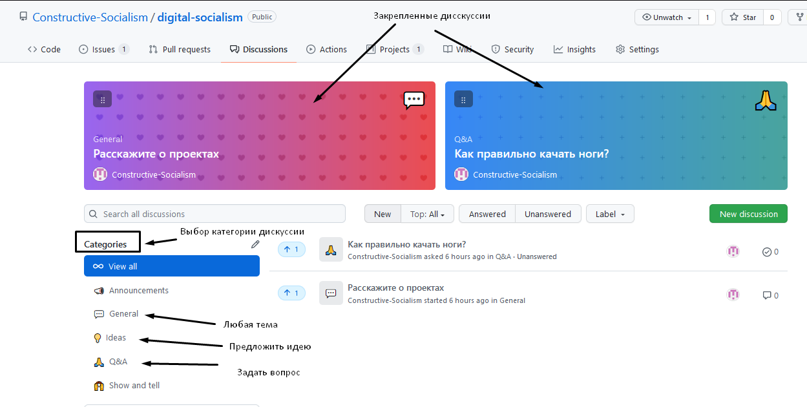
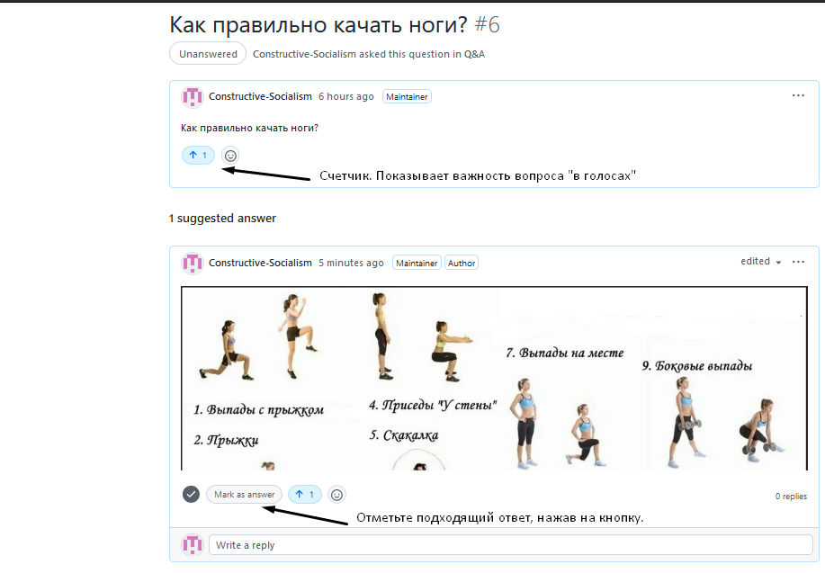

# Обсуждения

В спорах иногда рождаются дельные предложения. 
Спорить, обсуждать, задавать вопросы вы можете во вкладке `Discussions`(читается как `дискашэнс`, означает `дискуссии`).

1. Нажмите на большую зеленую кнопку `View on Github` выше.

1. Перейдите на вкладку **Discussions**.

1. Нажмите на заголовок дискуссии, чтобы присоединиться к ней.

1. Оставьте свой комментарий, повысьте важность вопроса или какого-либо ответа при помощи счетчика. Отправьте комментарий.

1. Не забудьте [добавить](./issues_guide.md) важные мысли в _отдельные_ `issues`.