# Замечания (Issues)

Чтобы оставить замечание к документу на GitHub, вам необходимо зарегистрироваться на GitHub. 

* [Нажмите здесь, чтобы посмотреть инструкцию](https://vertex-academy.com/tutorials/ru/kak-zaregistrirovatsya-na-github/).

## Создание замечания
`issue` (читается как `ищью`, означает `проблема`, `замечание`). 

Одно замечание - одна `issue`. 

1. Нажмите на большую зеленую кнопку `View on Github` выше.

1. Нажмите на **Issues** - `ищьюс`

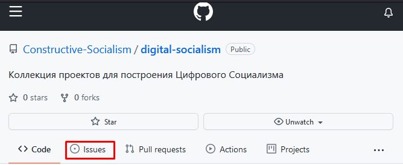

1. Заполните форму, используя [язык разметки Markdown](https://gist.github.com/Jekins/2bf2d0638163f1294637). 

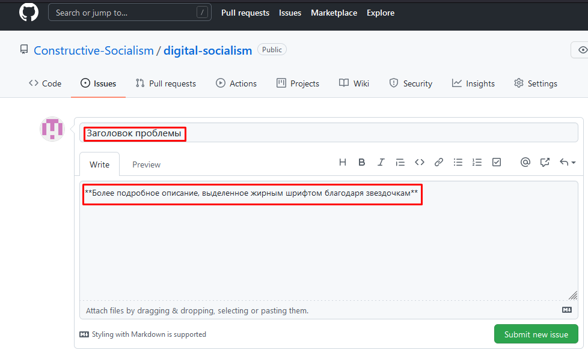

1. Вы можете использовать кнопки в форме, чтобы менять вид текста. Можете добавлять изображения, ссылки.

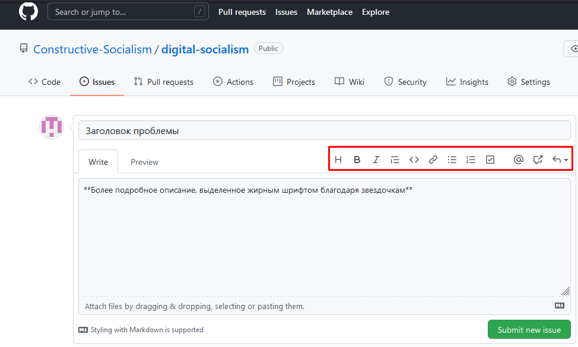

1. Посмотрите, как это выглядит теперь.

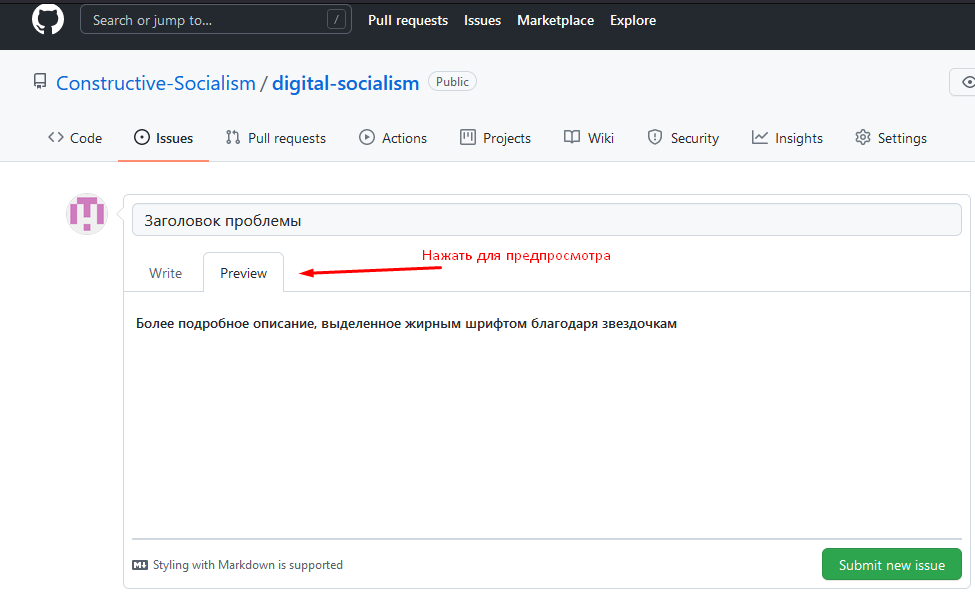

1. Отправьте замечание.

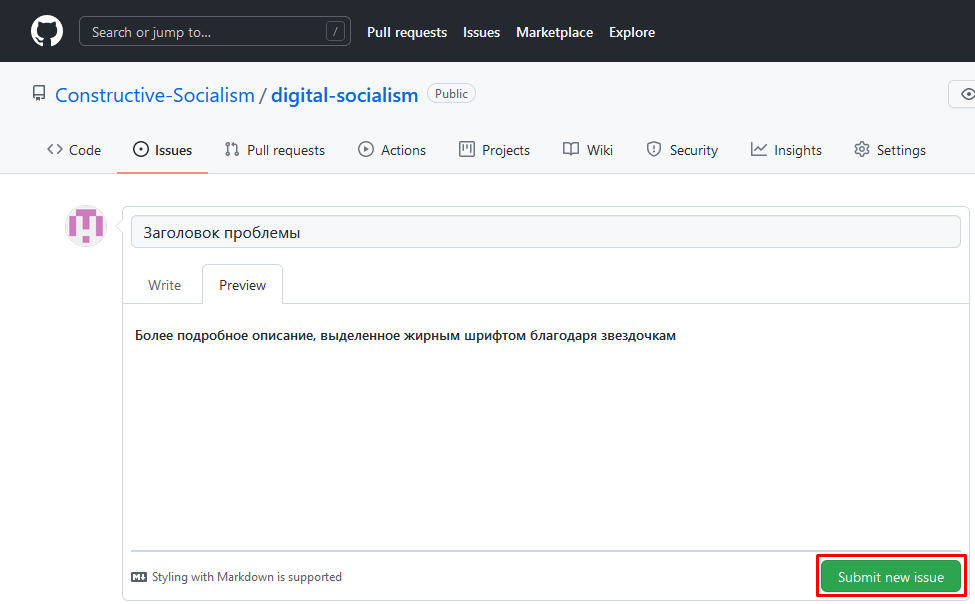

1. Выберите проект для него.

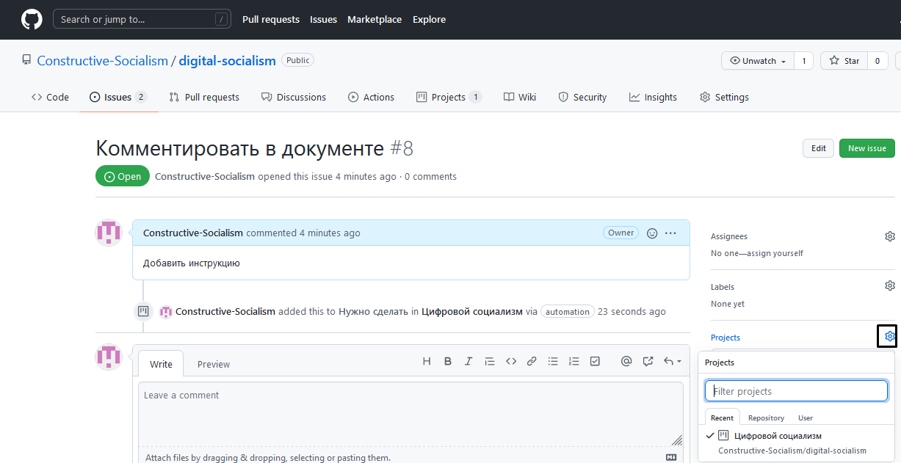

1. Теперь его можно найти в списке замечаний!

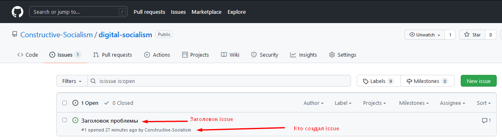

## Комментарии к issue
1. Повторите шаги 1-2 из [инструкции по созданию замечания](#создание-замечания).

1. Выберите интересующую вас `issue` и нажмите на ее название.

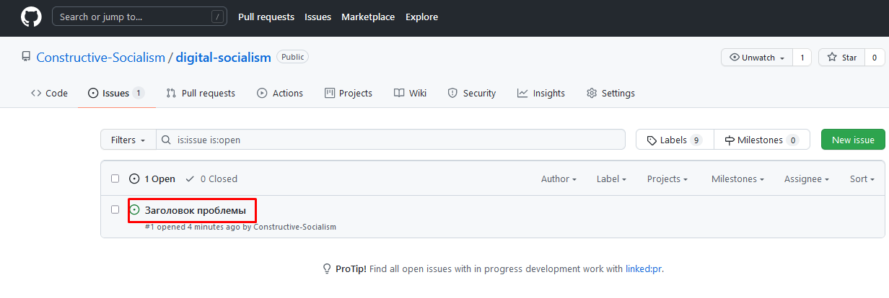

1. Напишите комментарий, заполнив форму.

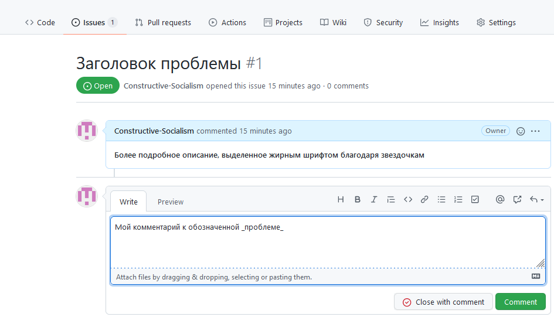

1. Посмотрите, как он выглядит.

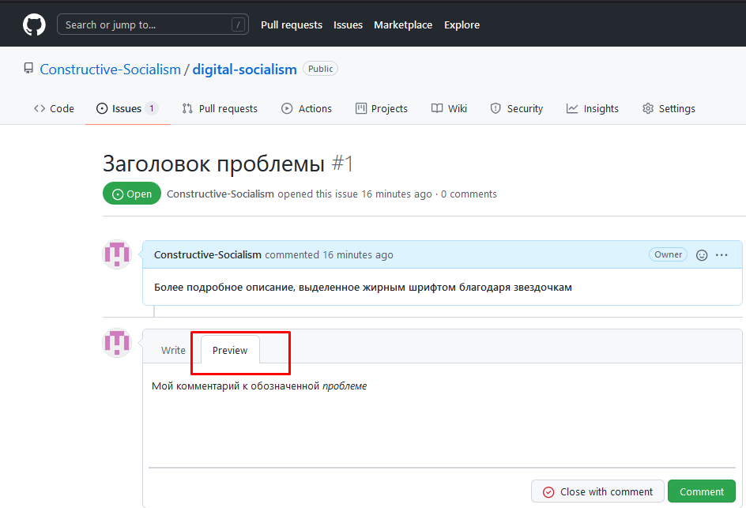

1. Нажмите на `Comment` (читается как `коммент`), чтобы отправить комментарий.

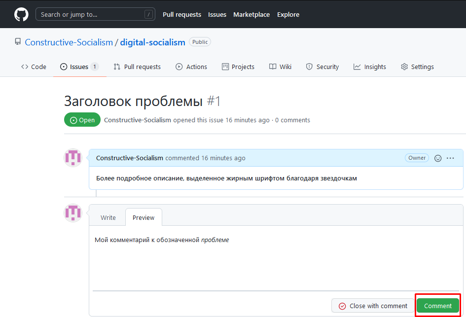

1. Теперь ваш комментарий появится в общем списке комментариев!

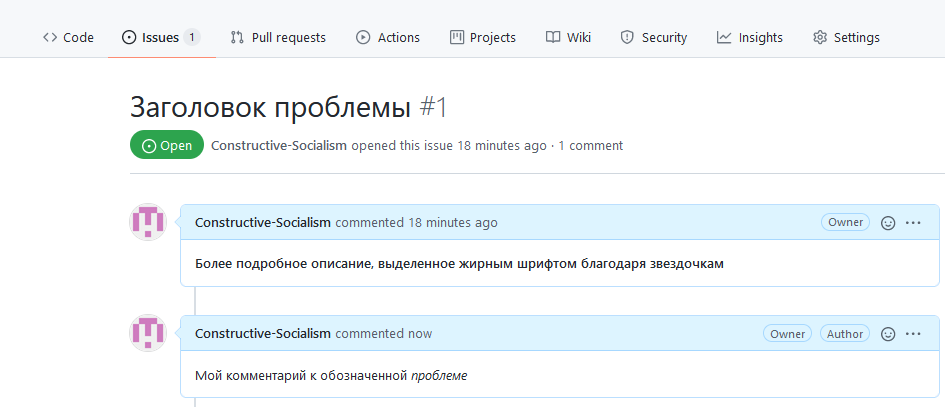

## Прогресс проекта
1. Перейдите на вкладку `Projects` и нажмите на заголовок проекта.

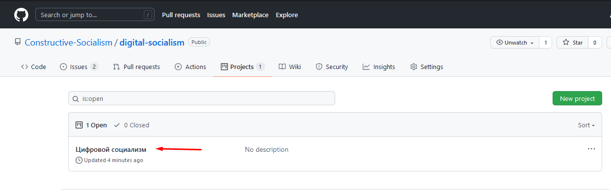

1. Можете посмотреть, что нужно сделать, что в работе и что готово.

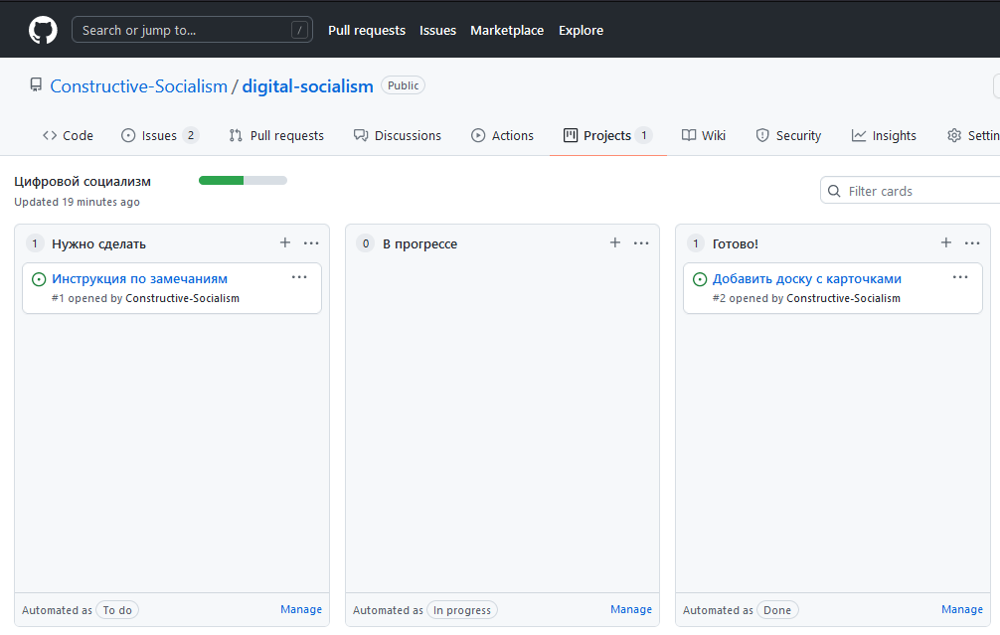

## Открытые и закрытые Issues
1. Вы можете посмотреть, какие `issues` открыты ( `open`), то есть не до конца решены.

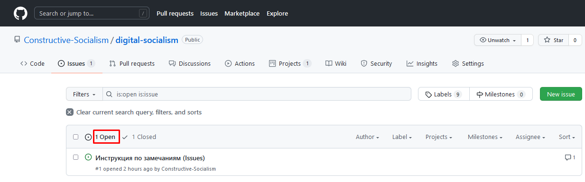

1. Здесь закрытые (`closed`) `issues`, то есть решенные.

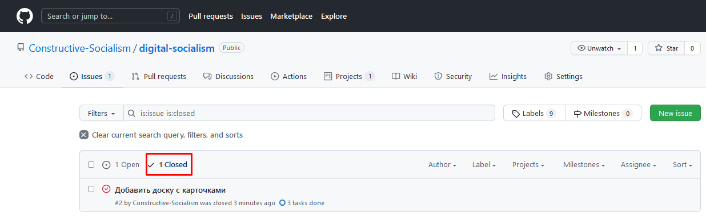

1. Новые `issues` автоматически попадают на доску проекта (см. [Прогресс проекта](#прогресс-проекта)).